Gli ambienti dell'ex scuola sono stati completamente ristrutturati e dotati di tutti i comfort per svolgere al meglio le vostre attività.

{:style="text-align:center;"}
[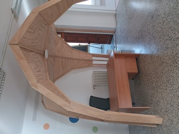](/img/reception.jpg) [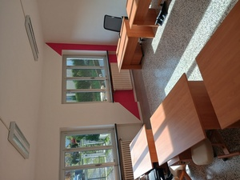](/img/cow_ros.jpg) [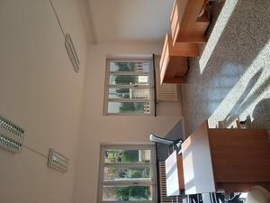](/img/cow_azz.jpg)  

Al piano rialzato sono presenti due sale condivise con 10 postazioni di lavoro complessive.
Tutti i locali del piano rialzato sono accessibili anche ai disabili motori.

{:style="text-align:center;"}
[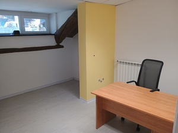](img/uff_gia.jpg) [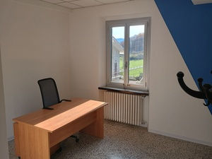](/img/uff_blu.jpg) [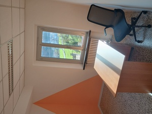](/img/uff_ara.jpg)  

Al primo piano sono stati ricavati tre uffici ad uso singolo, ideali per professionisti, per chi ha necessità di accogliere clienti o per chi semplicemente vuole godersi un po' di privacy...

{:style="text-align:center;"}
[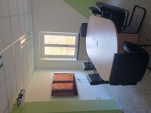](/img/conf.jpg) [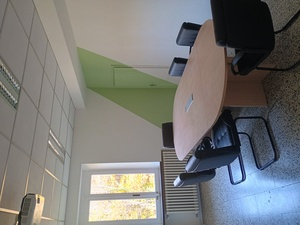](/img/conf2.jpg)  

Al primo piano è presente una sala conferenze allestita con un tavolo per otto persone e un doppio sistema di proiezione. Questo spazio è l'ideale per riunioni di team, presentazioni a piccoli gruppi, o per tenere corsi di aggiornamento.

{:style="text-align:center;"}
[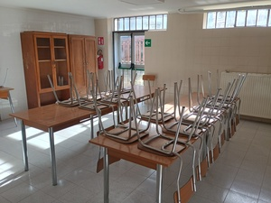](/img/refet.jpg) [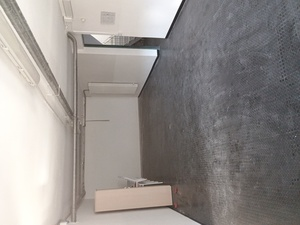](/img/sgomb.jpg)  

Nel seminterrato sono presenti altri ambienti, pensati come spazio condiviso per preparare e consumare pasti o per altri utilizzi che la vostra fantasia vorrà proporci!

**PLANIMETRIE**

{:style="text-align:center;"}
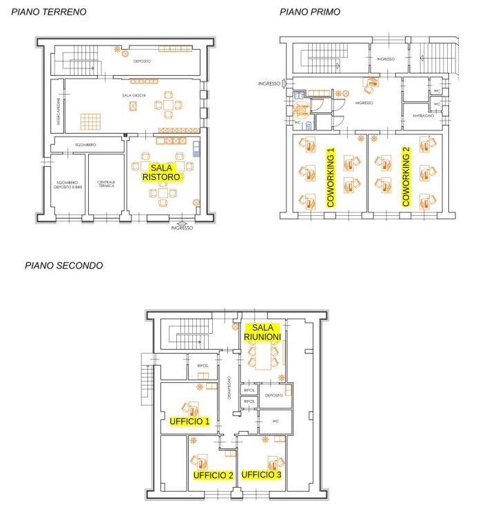
