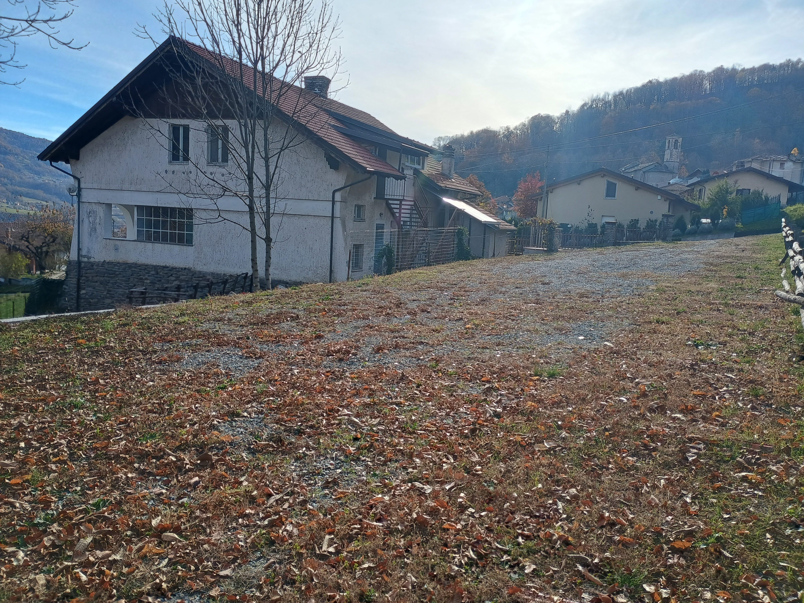
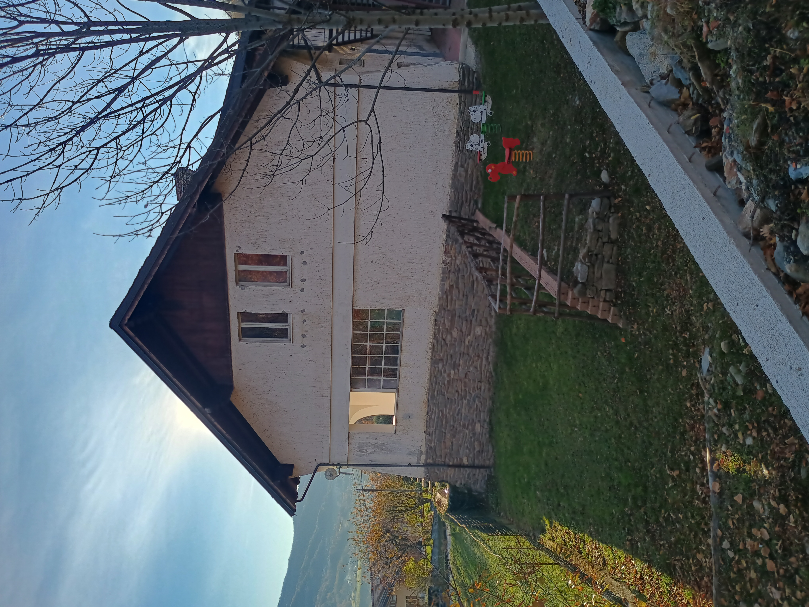

  
La scuola elementare della borgata Clot è stata utilizzata fino al 2018, anno della sua chiusura definitiva.

Il comune si è trovato quindi a dover gestire un edificio pubblico inutilizzato, che rischiava di diventare l'ennesima "cattedrale nel deserto" delle nostre valli.

Grazie ad un bando del GAL - Escartons e Valli Valdesi, si è potuto rifunzionalizzare la struttura per creare uno spazio polifunzionale che strizzasse l'occhio ai nuovi modi di intendere il lavoro e l'economia, a cominciare dallo smart working e passando per il nomadismo digitale.
Nasce così il coworking di Inverso Pinasca, esperimento primo nel suo genere nelle nostre vallate, che si propone come punto di partenza per intendere il territorio montano non più come area arretrata e legata alle tradizioni, ma come realtà proiettata al futuro che ancora molto può offrire anche alle nuove generazioni.

Il coworking è anche dotato di un ampio parcheggio  
  
ed i locali del piano rialzato sono accessibili anche a persone con mobilità ridotta.

Per chi avesse la necessità di conciliare il lavoro con la cura dei figli è presente un'area giochi all'aperto
  
ed è inoltre possibile usufruire di un servizio baby parking svolto in convenzione, con tariffe dedicate, dall'asilo nido "Colibrì" sito in Perosa Argentina.

**DOVE SIAMO**  
Il coworking si trova ad Inverso Pinasca, 5 minuti da Pinerolo, in via Remo Vola 2, all'ingresso della borgata Clot, centro storico del comune.  

<iframe src="https://www.google.com/maps/embed?pb=!1m18!1m12!1m3!1d2823.9422129356403!2d7.215311647909336!3d44.94484267681151!2m3!1f0!2f0!3f0!3m2!1i1024!2i768!4f13.1!3m3!1m2!1s0x478833005e869fb9%3A0x5f146be7fe8eafa4!2sCoworking%20di%20Inverso%20Pinasca!5e0!3m2!1sit!2sit!4v1764145400480!5m2!1sit!2sit" style="border:0; width:100%; height:400px;" allowfullscreen="" loading="lazy" referrerpolicy="no-referrer-when-downgrade"></iframe>

